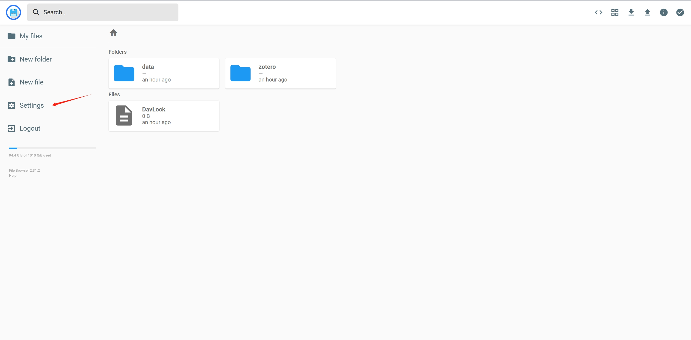
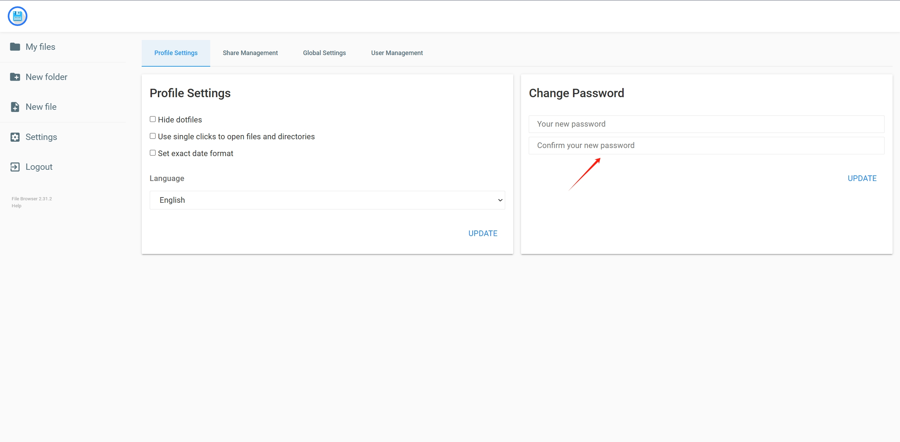

# webdav-nginx-autossl

## Overview

`webdav-nginx-autossl` helps you quickly set up a WebDAV service in Docker with automatic SSL support via Certbot. Additionally, it includes a web-based file browser UI (powered by [Filebrowser](https://filebrowser.org/)) for easy management of your WebDAV data.

## Features

- **WebDAV Service**: Securely store and access your files using WebDAV protocol.
- **Automatic SSL**: Automate SSL certificate management with Certbot.
- **File Browser UI**: Manage your files effortlessly via a user-friendly web interface.
- **Customizable**: Configure all settings using a .env file.

## Getting Started

Follow these steps to set up and start your WebDAV service:

1. Clone the Repository

   ```bash
   git clone https://github.com/GareArc/webdav-nginx-autossl.git
   cd webdav-nginx-autossl
   ```

2. Configure Environment Variables

    Copy the example .env file and customize it to fit your needs:

   ```bash
   cp .env.example .env
   ```

   Edit the .env file to configure WebDAV, Nginx, and Certbot settings:

   | **Variable**                     | **Description**                                              | **Default/Example**                 |
   | -------------------------------- | ------------------------------------------------------------ | ----------------------------------- |
   | `WEBDAV_USERNAME`                | Username for WebDAV authentication.                          | `yourusername`                      |
   | `WEBDAV_PASSWORD`                | Password for WebDAV authentication.                          | `yourpassword`                      |
   | `NGINX_SSL_PORT`                 | Internal Nginx HTTPS (SSL) service port.                     | `443`                               |
   | `NGINX_SSL_CERT_KEY_FILENAME`    | Filename of the SSL certificate private key.                 | `privkey.pem`                       |
   | `NGINX_SSL_CERT_FILENAME`        | Filename of the SSL certificate.                             | `fullchain.pem`                     |
   | `NGINX_PORT`                     | Internal Nginx HTTP service port.                            | `80`                                |
   | `NGINX_KEEPALIVE_TIMEOUT`        | Timeout setting for Nginx keepalive connections.             | `65`                                |
   | `NGINX_HTTPS_ENABLED`            | Enable HTTPS for Nginx.                                      | `false`                             |
   | `NGINX_ENABLE_CERTBOT_CHALLENGE` | Enable Certbot challenge for SSL certificate issuance.       | `false`                             |
   | `EXPOSE_NGINX_SSL_PORT`          | Port to expose Nginx HTTPS (SSL) service.                    | `443`                               |
   | `EXPOSE_NGINX_PORT`              | Port to expose Nginx HTTP service.                           | `80`                                |
   | `CERTBOT_OPTIONS`                | Additional options for Certbot.                              | _(Optional, leave blank)_           |
   | `CERTBOT_EMAIL`                  | Email address for Certbot notifications and registration.    | (Optional) `your-email@example.com` |
   | `CERTBOT_DOMAIN`                 | Domain for which to issue the SSL certificate using Certbot. | `your-domain.com`                   |

3. (Optional) Enable TLS/SSL

    To enable HTTPS with SSL/TLS, configure Certbot by following the [Certbot Configuration Guide](./certbot/README.md). Ensure that you update the `.env` file with your certificate details and set `NGINX_HTTPS_ENABLED` to `true`.

    You can also use existing certificate files directly by specifying their paths in the `.env` file. Refer to the environment variable settings in the table above for more details.

4. Start the WebDAV Service

    Launch the service using Docker Compose:

    ```bash
    docker compose up -d
    ```

    The service will start with the configurations defined in your `.env` file.

## Accessing the File Browser

Once the service is running, you can access the file browser at:

```shell
# http
http://{YOUR_SERVER_URL}/fb

# with TLS/SSL
https://{YOUR_SERVER_URL}/fb 
```

For example: `http://localhost/fb`.

### Default Login Credentials

- Username: `admin`
- Password: `admin`

It is recommended to change these credentials immediately after your first login. You can update them in the settings page.
    
    

### Notes

- **WebDAV Authentication**: The WebDAV username and password are configured in the .env file and are different from the Filebrowser credentials.
- **Certbot Setup**: Ensure you set up Certbot correctly if you plan to use HTTPS.
It is recommended to change these credentials immediately after your first login. You can update them in the settings page.

## Related Projects and Credits

This project builds upon and integrates several excellent tools and projects. Special thanks to the developers and maintainers of the following:

- [bytemark/webdav](https://github.com/BytemarkHosting/docker-webdav): A Docker solution for WebDAV.
- [Filebrowser](https://filebrowser.org/): A fantastic open-source file browser for managing files via a web UI.
- Certbot: A tool that automates the process of setting up and managing SSL/TLS certificates.
- Nginx: A powerful and flexible web server and reverse proxy.
- Docker Compose: Simplifies multi-container Docker applications.

These projects made `webdav-nginx-autossl` possible. Explore and support these tools to enhance your development experience!
